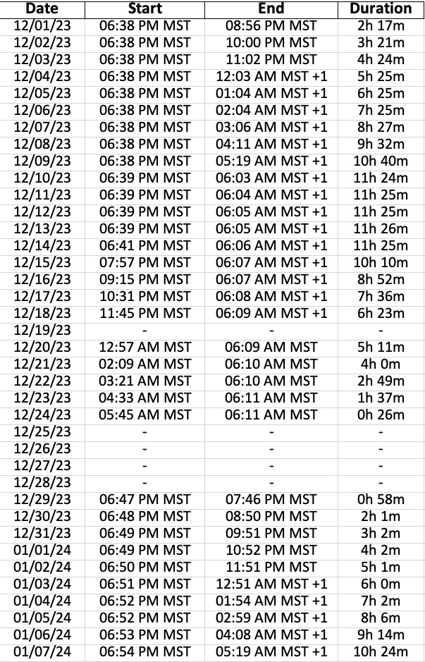
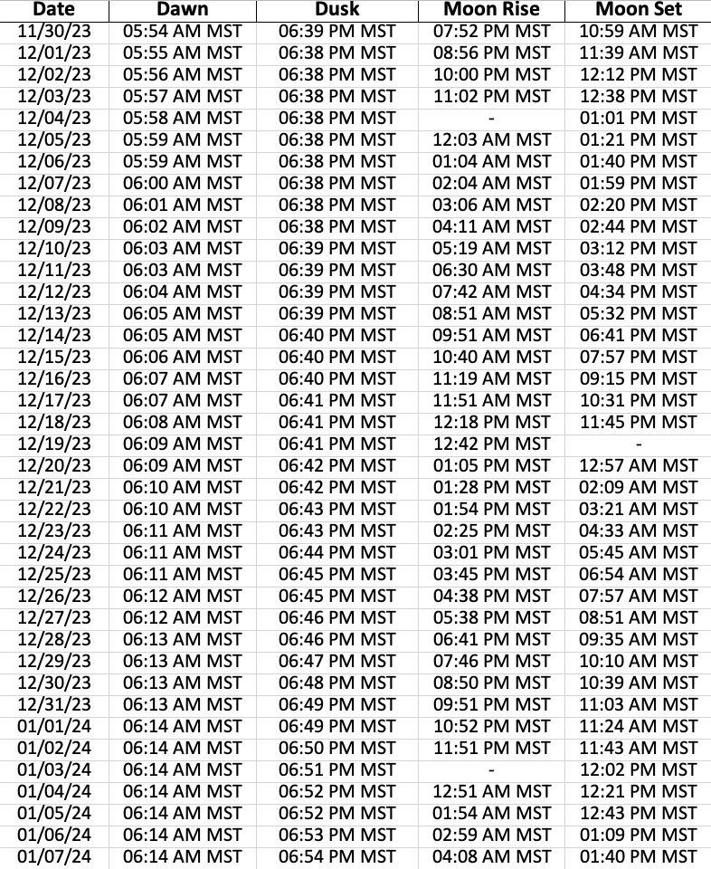
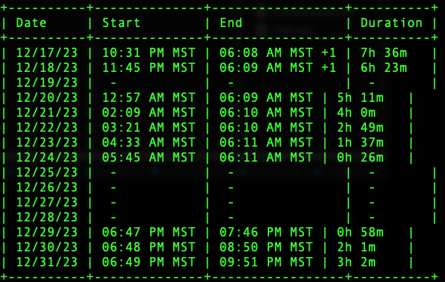
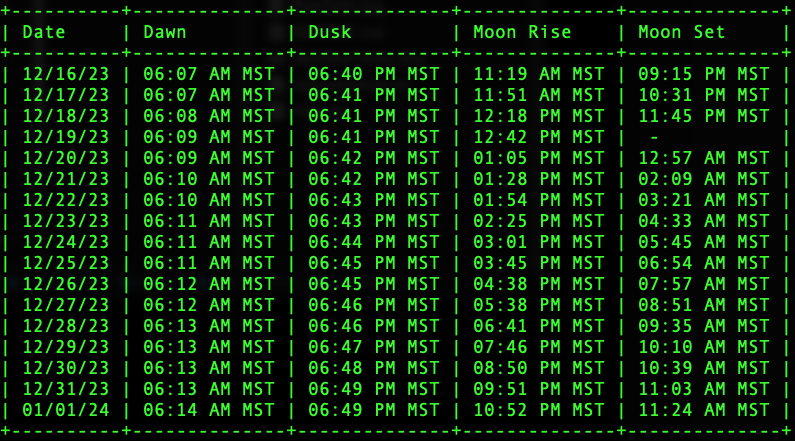

# darkSkyTimes

The darkSkyTimes repository allows users to easily determine the times when the sky is the darkest (i.e. between the times of astronomical twilight end and start, along with the absence of the moon for a desired location).

## Description

The darkSkyTimes repository allows users to effortlessly determine the optimal moments of darkness during the night sky. By inputting a desired date range and latitude/longitude coordinates, this project generates an Excel spreadsheet that calculates the times when there is no observable moon in the sky and the center of the sun is 18 degrees or more below the horizon. Each entry in the spreadsheet corresponds to an individual day within the specified range and provides precise data on astronomical twilight start, astronomical twilight end, moon rise, and moon set. The primary objective of darkSkyTimes is to facilitate the identification of ideal periods when the absence of astronomical twilight and the moon's presence converge, resulting in the darkest skies imaginable.

***Where this project is now***

Currently this project displays the data in the terminal window and also generates a .xlsx file that contains two sheets. The first sheet contains the ideal dark sky times and duration for the date range and location specified. The second sheet contains all of the raw data used to calculate this information.

Ideal dark times with duration example (sheet1 in .xlsx file):



Raw data output example (sheet2 in .xlsx file):



Ideal dark times with duration displayed in terminal (need to fix the padding):



Raw data displayed in terminal:




## Getting Started
### Dependencies
* Python3
* pip
* pipenv

### Installing
These installation instructions are written for Terminal in Mac OS X

* Run Terminal by navigating to Applications -> Utilities -> Terminal. You can also run Terminal by first pressing Command + Space Bar on your Mac, then typing in 'Terminal' and then pressing enter. 

* Check that you have all of the dependencies installed. Note that if you have Python 3.4 or above installed, pip is included by default, but it never hurts to double check. ALL of these dependencies MUST be installed. There are plenty of guides out there on how to install these if you are missing any. 
   ```bash
   python --version && pip --version && pipenv --version
   
* Use the terminal to navigate to the location where you want to save this project. In this example, I will choose my desktop. 
   ```bash
   cd Desktop

* Create a new directory named 'Dark_Sky_Times' (or whatever you want to name it) where the repository will be cloned.
  ```bash
   mkdir Dark_Sky_Times

* Navigate to the new folder that you just created.
   ```bash
   cd Dark_Sky_Times
   
* Clone the repository to your local machine.
   ```bash
   git clone https://github.com/BobbyBoy101/darkSkyTimes.git

* Navigate to the project directory.
   ```bash
   cd darkSkyTimes

* Create a virtual environment.
   ```bash
   pipenv install

* Activate the project's virtual environment.
   ```bash
   pipenv shell

* Install the required dependencies.
   ```bash
   pip install -r requirements.txt
   
### Usage

1. Any time you want to run this script, you must be in the project's virtual environment. If you followed the steps above, you should see that the '(base)' at the beginning of each terminal command changed to '(darkSkyTimes) (base)'. This means that you are in the darkSkyTimes virtual environment that you created. Each time you want to start a new instance of this script, just use the terminal to navigate to where you cloned the repository (i.e. cd desktop/Dark_Sky_times/darkSkyTimes) and then run 'pipenv shell' to activate the darkSkyTimes virtual environment before continuing with the next step. 
2. After successfully installing the dependencies or activating the darkSkyTimes virtual environment, you can run the script by adding the necessary arguments after 'python main.py' like this (dates should be in MM/DD/YYYY format):
   ```bash
   python main.py -lat 40.7720 -lon -112.1012 -start 04/01/2023 -end 12/31/2023
3. The raw data and the calculated ideal dark sky times with their duration will be displayed in your terminal window, which makes it easy if you only need to check a small date range.
4. Each time you run this script, a generated Excel spreadsheet named darkSkyTimes.xlsx will be saved in the project directory. The first sheet is the ideal times and duration and the second sheet is the raw data used to calculate those times. Don't have Microsoft Excel? Drop the file into Google Drive and open it with Google Sheets.
*** Please note that the generated darkSkyTimes.xlsx file will be overwritten each time this script is run. If you want to keep a copy, simply rename the darkSkyTimes.xlsx file to something else.

***KNOWN BUG: Generating data in a different time zone***

Please note that the -tz argument is currently non-functioning and the data will be generated in the time zone where your computer is located. If the latitude/longitude you enter is in your local time zone, then the data will be displayed correctly. However, if you enter a latitude/longitude that is in a different time zone from where you generate the data, then it will be displayed in your local time zone and you must offset the data accordingly. For example, if you are in MST and want to calculate data from a location in PST, then the data displayed will be an hour ahead of the actual time for that location. I am working on solving this problem and will update the code soon to allow the user to define the timezone that the output should be displayed in like this:
~~~
python main.py -lat 40.7720 -lon -112.1012 -start 04/01/2023 -end 12/31/2023 -tz America/Denver
~~~


***DISCLAIMER: Work in Progress***

*Please be aware that this project is a work in progress and is not considered complete at this stage. It may be undergoing active development, and significant changes could occur. The code, documentation, and other project assets presented here are subject to continuous improvements, updates, and enhancements. As such, I cannot guarantee the stability, reliability, or completeness of the current state of the project. I strongly advise against using this project in a production environment or for critical tasks at this time. It may contain bugs, security vulnerabilities, or incomplete features that could lead to unexpected behavior or data loss.*

### License
This project is licensed under the [MIT License](LICENSE)

