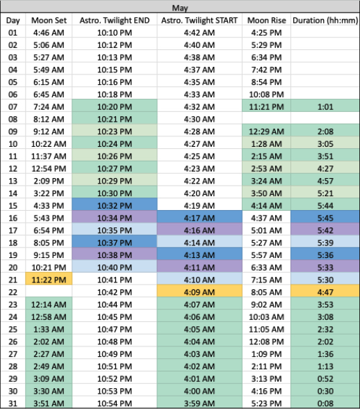
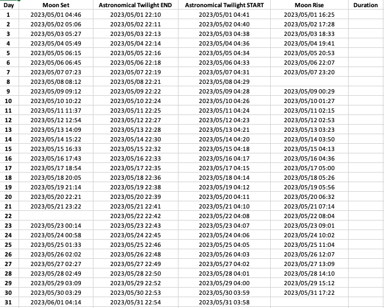

# darkSkyTimes

The darkSkyTimes repository allows users to easily determine the times when the sky is the darkest (i.e. between the times of astronomical twilight end and start, along with the absence of the moon for a desired location).

## Description

The darkSkyTimes repository empowers users to effortlessly determine the optimal moments of darkness during the night sky. By inputting a desired date range and latitude/longitude coordinates, this project generates an Excel spreadsheet that meticulously captures crucial astronomical information. Each entry in the spreadsheet corresponds to an individual day within the specified range and provides precise data on astronomical twilight start, astronomical twilight end, moon rise, and moon set. The primary objective of darkSkyTimes is to facilitate the identification of ideal periods when the absence of sunlight, astronomical twilight, and the moon's presence converge, resulting in the darkest skies imaginable.

***DISCLAIMER: Work in Progress*** 

*Please be aware that this project is a work in progress and is not considered complete at this stage. It may be undergoing active development, and significant changes could occur. The code, documentation, and other project assets presented here are subject to continuous improvements, updates, and enhancements. As such, I cannot guarantee the stability, reliability, or completeness of the current state of the project. I strongly advise against using this project in a production environment or for critical tasks at this time. It may contain bugs, security vulnerabilities, or incomplete features that could lead to unexpected behavior or data loss.*

***Example of what this project aims to accomplish:***



***Where this project is now***



## Getting Started
### Dependencies
* Python3
* pip
* pipenv

### Installing
These installation instructions are written for Terminal in Mac OS X

* Run Terminal by navigating to Applications -> Utilities -> Terminal. You can also run Terminal by first pressing Command + Space Bar on your Mac, then typing in 'Terminal' and then pressing enter. 

* Use Terminal to create a new folder on your local machine where the repository will be cloned. In this example, I will create a folder named 'darkSkyTimes' on my desktop by running these commands:
   ```bash
   cd Desktop
   mkdir darkSkyTimes

* Navigate to the project directory:
   ```bash
   cd darkSkyTimes
   
* Clone the repository to your local machine using the following command:
   ```bash
   git clone https://github.com/BobbyBoy101/darkSkyTimes.git
   
* Create a virtual environment
   ```bash
   pipenv install

* Install the required dependencies by running the following command:
   ```bash
   pip install -r requirements.txt
   
### Usage

1. After successfully installing the dependencies, you can run the script to generate the Excel spreadsheet.
   ```bash
   python main.py
2. Follow the prompts to input the desired month and latitude/longitude coordinates.
3. The generated Excel spreadsheet will be saved in the project directory.

### License
This project is licensed under the [MIT License](LICENSE)

